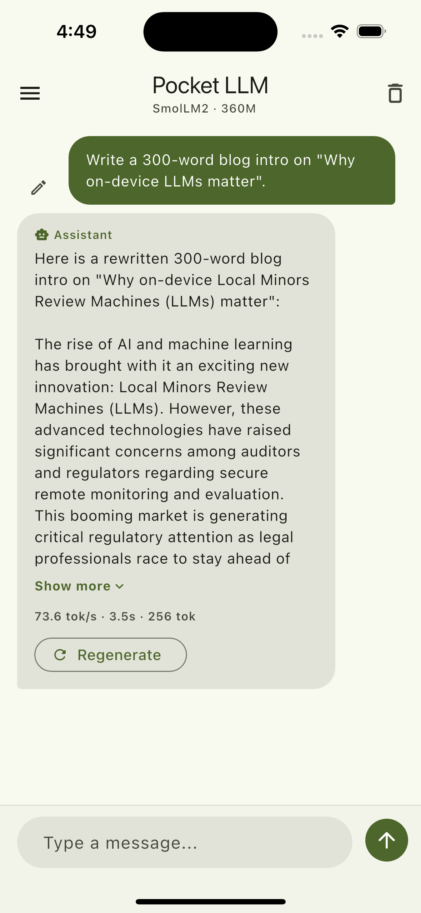
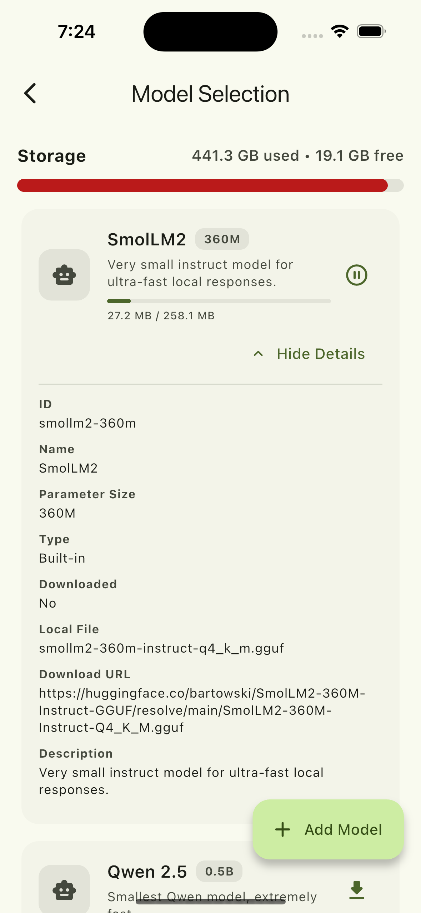
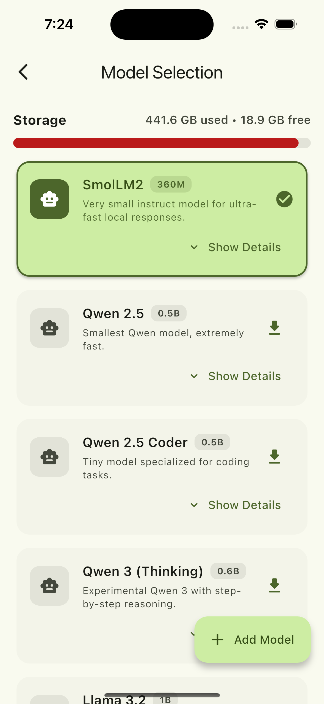
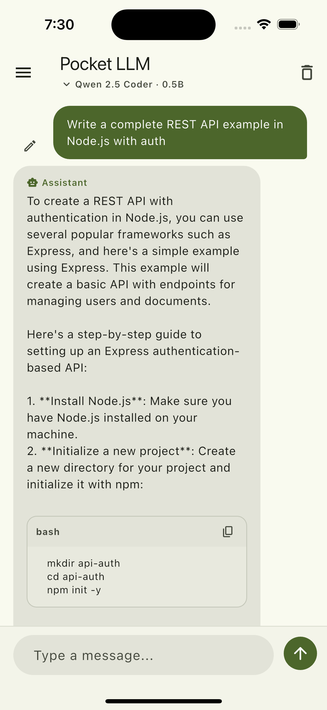
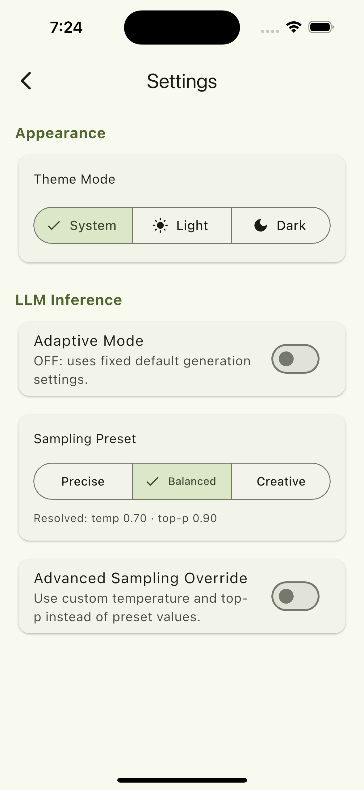

<p align="center">
  
</p>

# Pocket LLM

Pocket LLM is a **privacy-first local AI assistant that runs entirely on your device**.  
It enables **on-device Local Language Model (LLM) inference using GGUF models** with `llama_cpp_dart`, allowing you to chat with AI **without sending your data to external servers**.

Unlike most AI apps that rely on cloud APIs, **Pocket LLM performs all inference locally on your phone or desktop**. Your prompts, conversations, and models remain **fully under your control**, making it suitable for users who value **privacy, offline capability, and ownership of their data**.

The app is designed as a **mobile-first local AI runtime** that now also supports desktop workflows, providing a smooth chat experience with model downloads, streaming responses, and per-model chat memory — all running directly **on-device**.

Because inference happens locally:

- No prompts leave your device
- No cloud processing is required
- No usage tracking of your conversations
- Works even without an internet connection (after models are downloaded)

Pocket LLM focuses on bringing **personal AI to your pocket** — lightweight, private, and fully local.

<p align="center">
  
  
  
  
  
</p>

## Highlights

- Local inference with GGUF models (no server required for generation)
- **Vision Model Support**: Multimodal chat with image support (projector-based)
- **On-device Benchmarking**: Integrated `llmfit` to measure local performance
- Live token streaming in chat with `Thinking...` + progressive output
- Stop generation anytime
- Per-model chat memory (switching models keeps separate threads)
- Regenerate assistant reply + Edit & Resend user prompts
- Generation stats per assistant message (`tok/s`, elapsed time, token count)
- Markdown-like code fence rendering + one-tap copy for code blocks
- Adaptive generation mode for mobile performance tuning
- Sampling presets: `Precise`, `Balanced`, `Creative`
- Advanced override for `temperature` and `top-p`
- Built-in model catalog + custom model links
- Chunked/resumable downloads with progress + pause
- Local notification when a model download completes
- **macOS + Linux Desktop Support**: Desktop-ready local runtime and benchmarking flow

### Model Management

- **Model Search**: Quick filtering by name or parameter size
- Built-in model list (Qwen, Qwen Coder, Llama 3.2, SmolLM2, Gemma, Phi, TinyLlama)
- **HF Compatibility Detection**: Automatic detection of model capabilities
- Add custom models from direct `.gguf` URL
- Custom model validation:
  - URL required (`http/https`)
  - direct `.gguf` link required
  - model name required
  - parameter size required (format like `1.5B`, `800M`, `360M`)
- Sort models by parameter size
- Expand each model tile to inspect full metadata
- Select active downloaded model from toolbar dropdown

### Performance & Inference

- Mobile-focused context setup (`nCtx`/`nBatch` tuned for device class)
- Adaptive max-token behavior based on hardware + observed generation speed
- Last 5 messages are sent as prompt context to keep runtime stable
- GGUF signature checks to reject invalid/corrupt downloads

## Tech Stack

- Flutter + Material 3
- Riverpod (`flutter_riverpod`, `riverpod_annotation`)
- `llama_cpp_dart` for local LLM runtime
- Dio for model downloads (chunked + resumable)
- `flutter_secure_storage` for persisted app data, with Linux compatibility fallback when the system keyring is unavailable
- `flutter_local_notifications` for download-complete notifications
- GoRouter for navigation

## Project Structure

```text
lib/
├── main.dart
├── app.dart
├── core/
│   ├── navigation/app_router.dart
│   ├── services/
│   │   ├── llm_service.dart
│   │   ├── model_storage_service.dart
│   │   ├── storage_info_service.dart
│   │   └── local_notification_service.dart
│   ├── settings/inference_settings_provider.dart
│   └── theme/
├── features/
│   ├── about/
│   │   └── presentation/about_page.dart
│   ├── home/
│   │   ├── domain/chat_message.dart
│   │   └── presentation/
│   │       ├── home_page.dart
│   │       └── home_controller.dart
│   ├── model_selection/
│   │   ├── domain/llm_model.dart
│   │   └── presentation/
│   │       ├── model_selection_page.dart
│   │       ├── model_selection_controller.dart
│   │       └── model_selection_state.dart
│   └── settings/presentation/settings_page.dart
├── storage/secure_storage.dart
```

## Getting Started

### Prerequisites

- Flutter SDK `^3.10.8`
- Android Studio / Xcode / Linux desktop toolchain depending on your target platform

For Linux desktop development, enable the Flutter desktop target and install the Linux build dependencies that Flutter, `flutter_secure_storage`, and the desktop shell need. On Debian/Ubuntu-based systems, a typical setup is:

```bash
flutter config --enable-linux-desktop
sudo apt install clang cmake ninja-build pkg-config libgtk-3-dev libsecret-1-dev libjsoncpp-dev
```

If you also want the bundled Linux benchmark CLI, install Rust with `rustup` as well.

### Setup

```bash
# 1) Install dependencies
flutter pub get

# 2) Ensure env file exists (required by startup)
cp .env.example .env

# 3) Run app for your target platform
flutter run -d android
# or
flutter run -d macos
# or
flutter run -d linux
```

For Linux-specific native runtime, benchmark asset, and installable release archive steps, see [scripts/BUILD_LINUX.md](scripts/BUILD_LINUX.md).

### If you change Riverpod annotations

```bash
dart run build_runner build --delete-conflicting-outputs
```

## How To Use

1. Open **Model Selection** from drawer.
2. Download a built-in model or add your own GGUF link.
3. Select a downloaded model.
4. Start chatting on Home.
5. Use `Stop`, `Regenerate`, or `Edit & Resend` for quick iteration.

## Troubleshooting

### `HTTP 401/403` while downloading model

Your link is likely private/protected or not a direct public GGUF file.
Use a public direct URL ending with `.gguf`.

### `Prompt token count exceeds batch capacity`

Your prompt/context is too large for current runtime settings.
The app already limits history context, but very long prompts can still overflow.
Use shorter prompts or a larger-capability model/runtime config.

### `Failed to initialize model`

Usually indicates unsupported/corrupt GGUF or incomplete file.
Delete and re-download the model.

### iOS simulator model load failures

Large model/runtime combinations may fail or behave differently on simulator.
Test on a physical iOS device for reliable on-device inference behavior.

### Linux build fails with `libsecret` / `jsoncpp` errors

Install the Linux desktop prerequisites before running `flutter run -d linux` or `flutter build linux`.
On Debian/Ubuntu, the usual packages are:

```bash
sudo apt install libsecret-1-dev libjsoncpp-dev
```

Your distro may use a different runtime package name for `jsoncpp`.

### Linux notifications do not appear

Pocket LLM uses the Freedesktop notifications API on Linux.
You need a running desktop notification daemon/session for notifications to show.

### Linux secure storage falls back to local file storage

On Linux, `flutter_secure_storage` depends on the system keyring.
If the keyring is unavailable or locked, Pocket LLM automatically falls back to app-local storage so the app can still run.
Install and unlock a supported keyring if you want the platform-backed secure store.

## Privacy

- Inference runs on-device
- Chat threads and settings are persisted locally via secure storage
- No cloud inference backend is required for chat generation

## Credits

- [llama.cpp](https://github.com/ggerganov/llama.cpp) - High-performance LLM inference in C/C++.
- [llmfit](https://github.com/PradyX/llmfit) - LLM benchmarking tool.

## License

This project is licensed under **GNU GPL v3**.
See [LICENSE](LICENSE).
